# Lab8Web
## PHP dan Database MySQL

### Menjalankan Web server
Pertama, kita harus menjalankan web server yang ada di XAMPP control begini tampilannya:
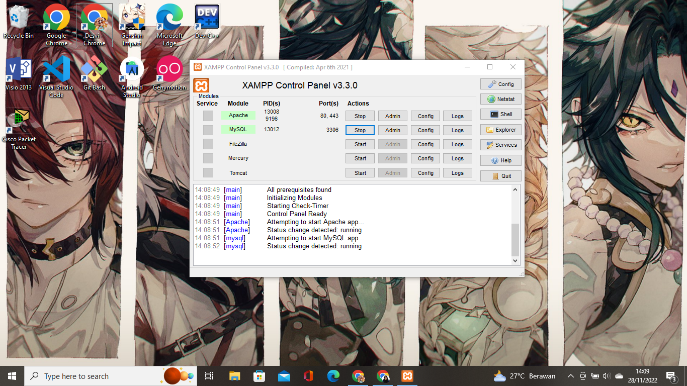

### Membuat Database
Kedua, pastikan webserver Apache dan MySQL telah berjalan begini kemudian buka melalui browser : http://localhost/phpmyadmin/, begini  tampilannya:
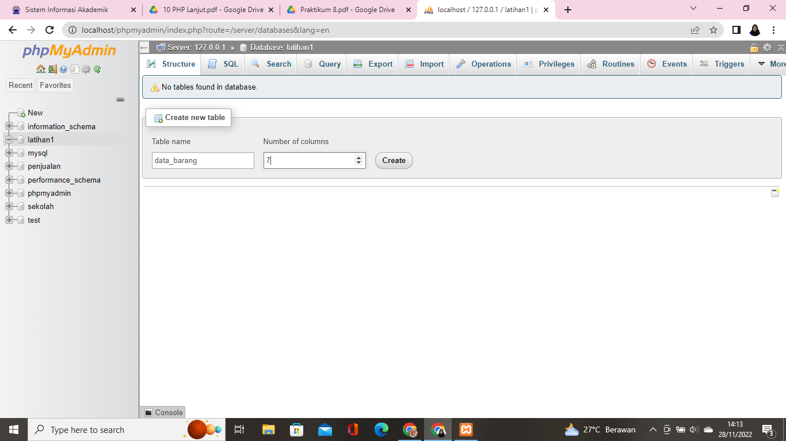

Lalu, membuat tabel dan menambahkan data pada tabel tersebut, begini tampilannya:
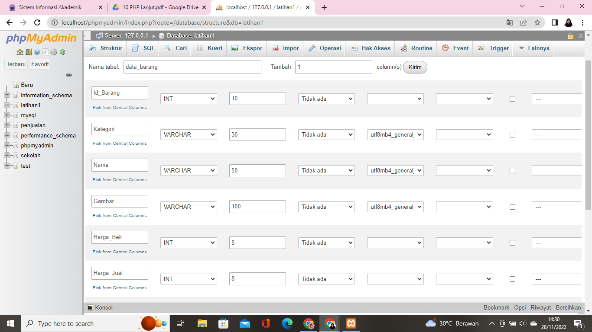
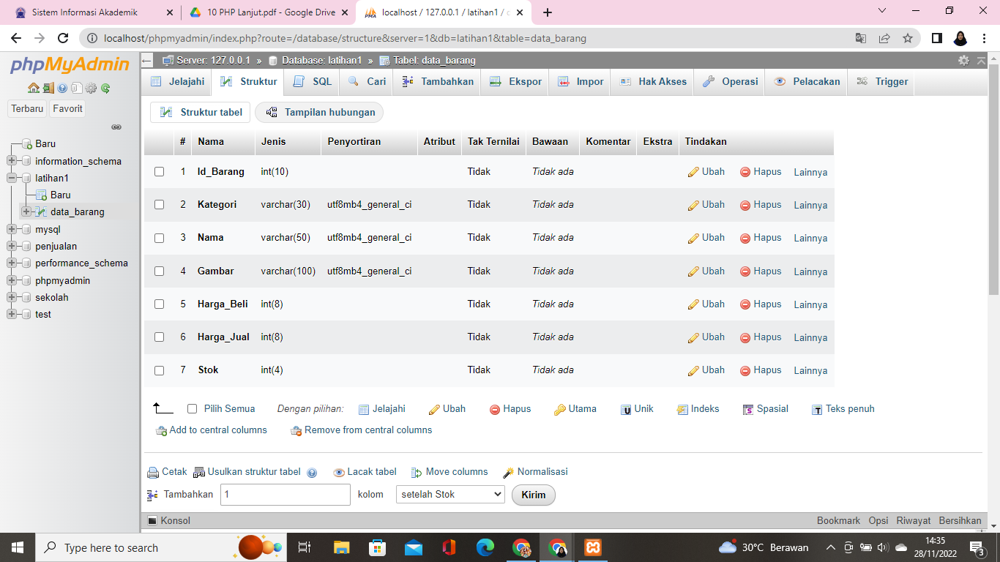
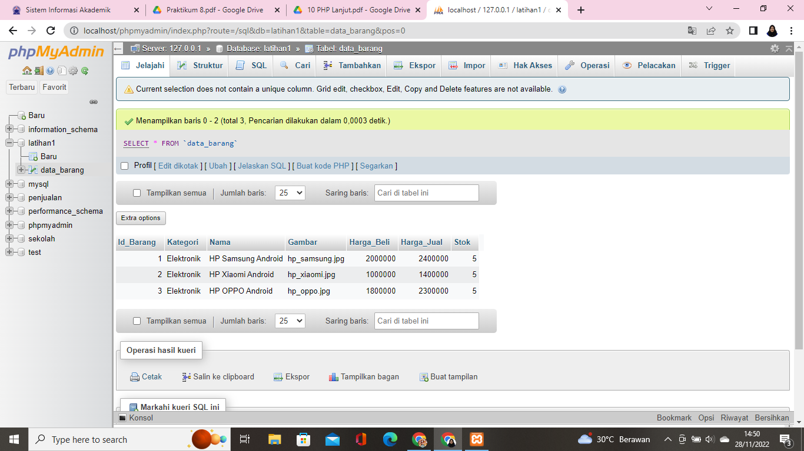

### Membuat Program CRUD
Setelah membuat database dan tabel saya mengecek database yang saya buat pada cmd, begini tampilannya:
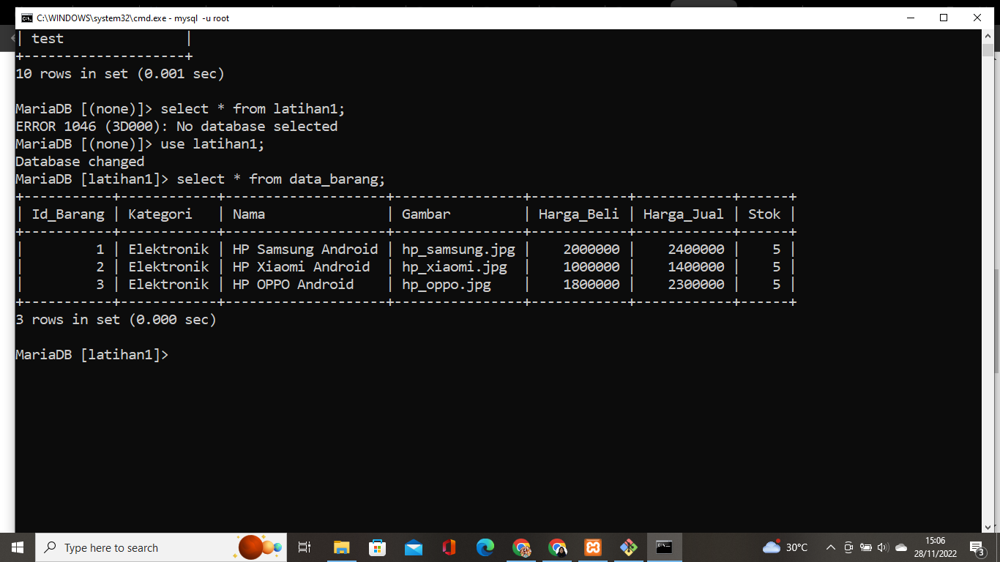

Lalu, saya membuat folder baru dengan nama lab8_php_database pada root directory web server (d:\xampp\htdocs) dan kemudian untuk mengakses nya menggunakan URL http://localhost/lab8_php_database/, begini tampilannya:
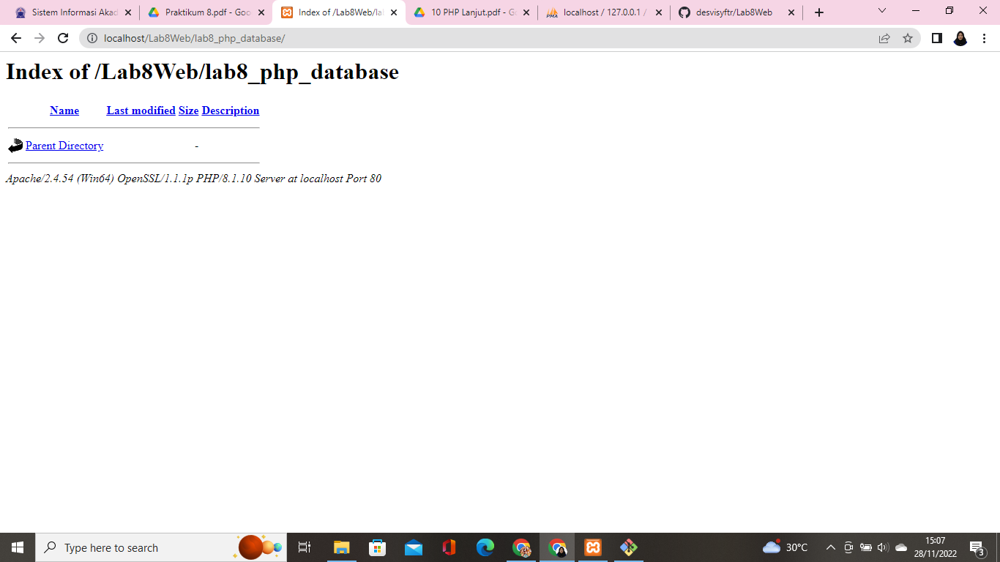

### Membuat File Koneksi Database
Lalu, saya membuat file baru dengan nama koneksi.php dan buka melalui browser untuk menguji koneksi database (untuk menampilkan koneksi berhasil, uncomment pada perintah echo "koneksi berhasil") beginilah tampilannya:
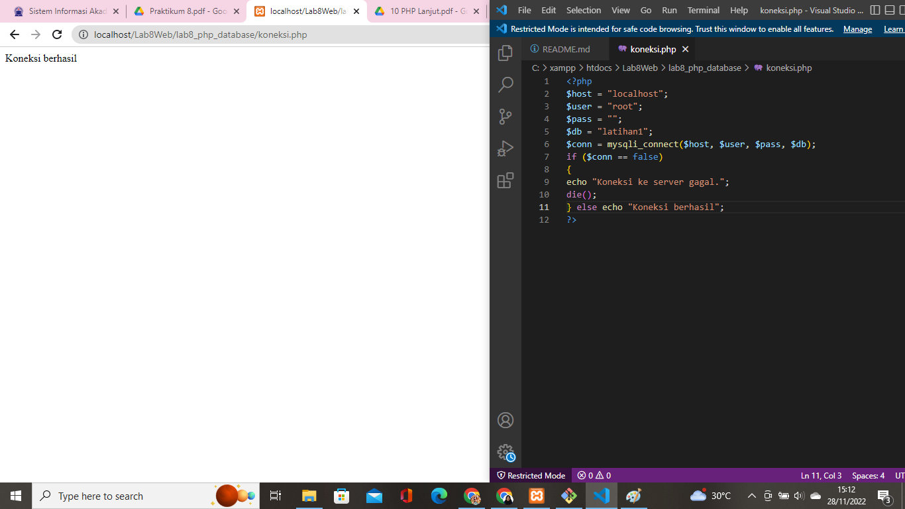

### Membuat File Index
Membuat file index untuk menampilkan data dengan buat file baru bernama index.php, begini tampilannya:
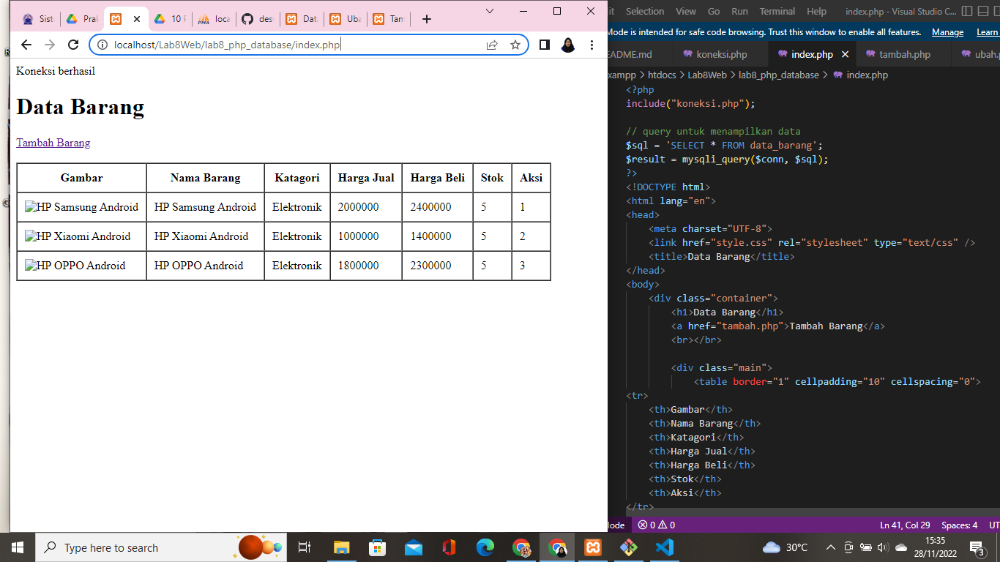

### Menambah Data
Menambah data dengan membuat file baru bernama tambah.php, begini tampilannya:
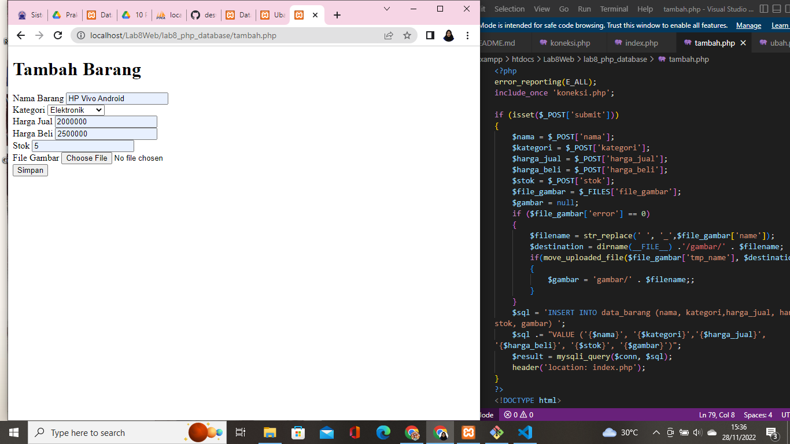

Dan ini adalah hasil dari menambahkan barang tersebut:
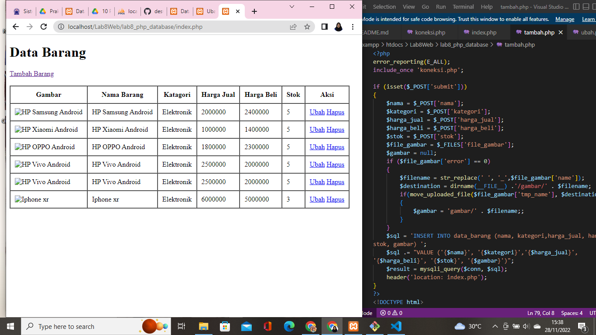

### Mengubah Data
Mengubah data (update) dengan membuat file bernama ubah.php begini tampilannya:
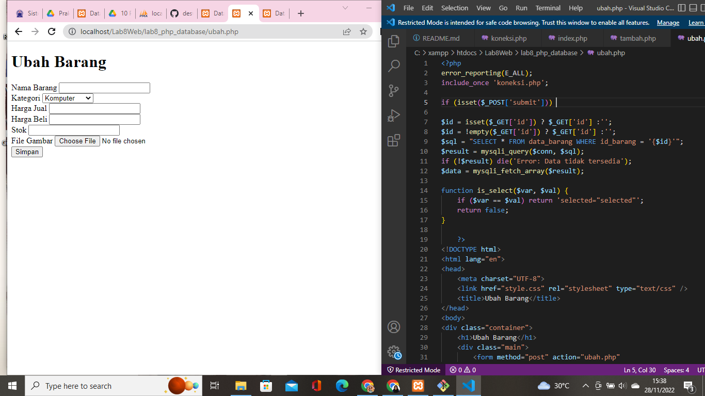

### Menghapus Data
Membuat file baru dengan nama hapus.php untuk menghapus data, begini tampilannya:
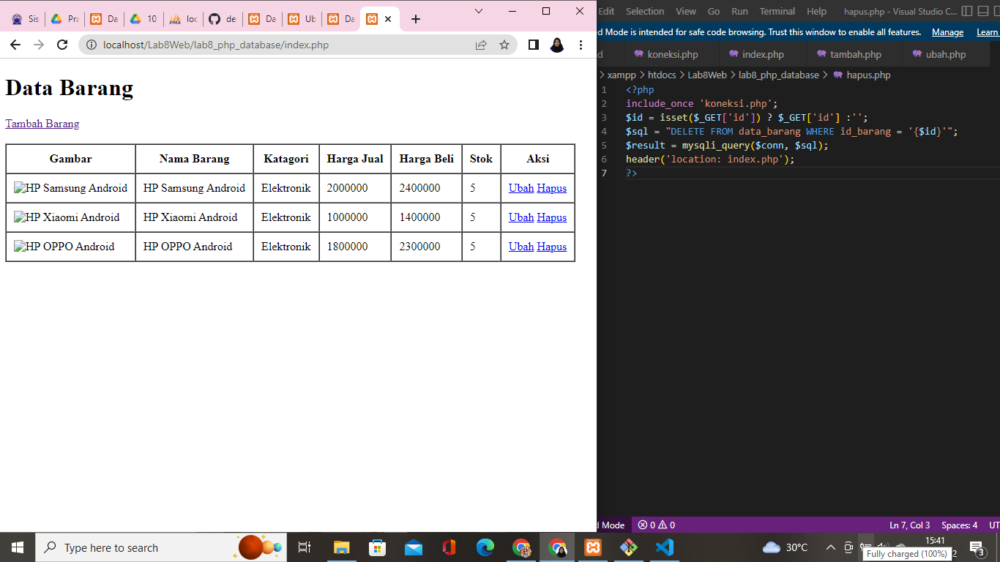